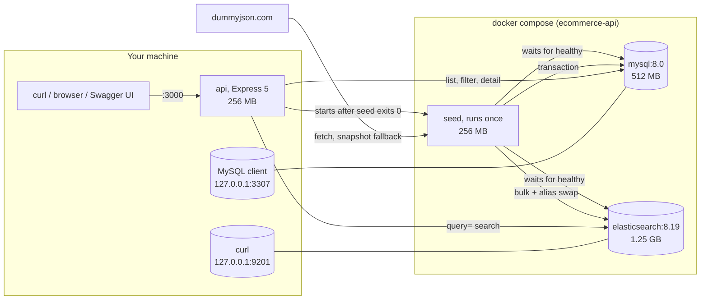
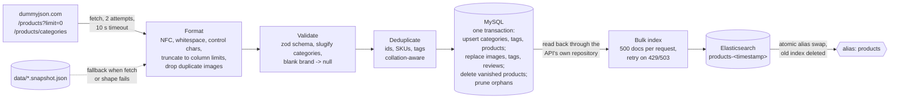
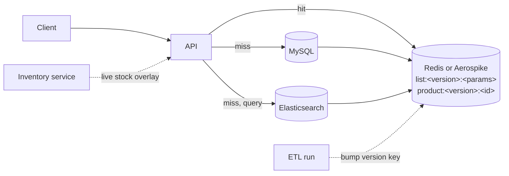

# E-commerce API

A product catalogue REST API built with Node.js 22, Express 5, MySQL 8 and Elasticsearch 8. The catalogue is
loaded from [dummyjson.com/products](https://dummyjson.com/products) by an ETL script that writes a normalised
relational schema in MySQL and a search index in Elasticsearch. Listing, filtering and product detail are served
from MySQL; free-text search is served from Elasticsearch.

## Quick start

Requirements: Docker with Compose v2. Nothing else is installed on your machine.

```sh
git clone <this repository> ecommerce-api && cd ecommerce-api
docker compose up --build -d --wait      # ~20 s once images are cached; first run also downloads ~3 GB
curl -s http://localhost:3000/health     # {"status":"ok","checks":{"mysql":"up","elasticsearch":"up"}}
open http://localhost:3000/docs          # Swagger UI (xdg-open on Linux)
npm ci && npm test                       # 116 unit and HTTP tests, no database needed
npm run smoke                            # 16 end-to-end checks plus latency samples against the running stack
docker compose down                      # stop; add -v to also delete the data
```

What `docker compose up` does, in order: starts MySQL and Elasticsearch and waits for their health checks;
runs the `seed` container once (fetch, format, validate, write MySQL, build the search index, exit 0); starts
the `api` container on <http://localhost:3000>. Measured on a laptop with images cached: 18 s to all four
services healthy, of which the ETL is 1.5 s.

Every container has a memory limit (Elasticsearch 1.25 GB, MySQL 512 MB, seed and API 256 MB each). MySQL and
Elasticsearch are published on `127.0.0.1:3307` and `127.0.0.1:9201` so they never collide with instances you
already run. On a Linux host without Docker Desktop, Elasticsearch may need
`sudo sysctl -w vm.max_map_count=262144` once.

| Command                        | What it does                                                            |
| ------------------------------ | ----------------------------------------------------------------------- |
| `docker compose ps`            | Status of the four services; `api` should be `healthy`, `seed` exited 0 |
| `docker compose logs seed`     | The ETL run: what was fetched, formatted, written and indexed           |
| `docker compose logs -f api`   | One JSON line per request                                               |
| `docker compose run --rm seed` | Re-runs the ETL (idempotent)                                            |
| `docker compose down -v`       | Stops everything and deletes the data (needed after schema edits)       |

Ports and credentials can be overridden by copying `.env.example` to `.env`; every value has a default.

### Trying the API

Swagger UI: <http://localhost:3000/docs> (every endpoint, parameter and response can be executed from the
browser). The raw OpenAPI document is at <http://localhost:3000/openapi.json>.

```sh
curl 'http://localhost:3000/health'
curl 'http://localhost:3000/categories'
curl 'http://localhost:3000/products?limit=5'
curl 'http://localhost:3000/products/1'
curl 'http://localhost:3000/products?category=smartphones'
curl 'http://localhost:3000/products?query=mascara'                 # full text
curl 'http://localhost:3000/products?query=mascra'                  # typo tolerant
curl 'http://localhost:3000/products?query=cellphone'               # synonym of phone / smartphone
curl 'http://localhost:3000/products?query=essenc'                  # prefix, search-as-you-type
curl 'http://localhost:3000/products?query=phone&category=smartphones&minRating=4&maxPrice=1000'
curl 'http://localhost:3000/products?minPrice=10&maxPrice=50&page=2&limit=10'
```

### Looking inside MySQL

```sh
docker compose exec mysql mysql -uapp -papp ecommerce            # interactive shell
docker compose exec mysql mysql -uapp -papp ecommerce -e 'SHOW TABLES'
docker compose exec mysql mysql -uapp -papp ecommerce -e 'SHOW CREATE TABLE products\G'
docker compose exec mysql mysql -uapp -papp ecommerce -e '
  SELECT p.id, p.title, c.slug, p.price, GROUP_CONCAT(t.name ORDER BY pt.position) AS tags
    FROM products p JOIN categories c ON c.id = p.category_id
    LEFT JOIN product_tags pt ON pt.product_id = p.id LEFT JOIN tags t ON t.id = pt.tag_id
   GROUP BY p.id ORDER BY p.id LIMIT 5'
```

From a client on your machine: host `127.0.0.1`, port `3307`, user `app`, password `app`, database `ecommerce`.

### Looking inside Elasticsearch

```sh
curl -s 'http://127.0.0.1:9201/_cat/aliases/products?v'      # the physical index behind the alias
curl -s 'http://127.0.0.1:9201/_cat/indices?v'
curl -s 'http://127.0.0.1:9201/products/_mapping'
curl -s 'http://127.0.0.1:9201/products/_count'
curl -s 'http://127.0.0.1:9201/products/_search' -H 'content-type: application/json' -d '{
  "query": { "multi_match": { "query": "mascra", "fields": ["title^3", "description"], "fuzziness": "AUTO" } },
  "_source": ["id", "title", "category", "price"], "size": 3 }'
curl -s 'http://127.0.0.1:9201/products/_analyze' -H 'content-type: application/json' \
  -d '{ "analyzer": "product_search", "text": "Women'"'"'s cellphones" }'
```

### Without Docker

You need MySQL 8 and Elasticsearch 8 reachable from your machine (the compose services work: start them with
`docker compose up mysql elasticsearch` and use the ports below), then:

```sh
npm ci
MYSQL_PORT=3307 ELASTICSEARCH_URL=http://localhost:9201 npm run seed   # tables, data, index
MYSQL_PORT=3307 ELASTICSEARCH_URL=http://localhost:9201 npm start      # or: npm run dev
```

Configuration is read from environment variables and validated at startup (`src/config.js`):

| Variable                        | Default                 |
| ------------------------------- | ----------------------- |
| `PORT`                          | `3000`                  |
| `MYSQL_HOST` / `MYSQL_PORT`     | `localhost` / `3306`    |
| `MYSQL_USER` / `MYSQL_PASSWORD` | `app` / `app`           |
| `MYSQL_DATABASE`                | `ecommerce`             |
| `ELASTICSEARCH_URL`             | `http://localhost:9200` |
| `ELASTICSEARCH_INDEX`           | `products`              |
| `DATA_SOURCE_URL`               | `https://dummyjson.com` |
| `SEED_FALLBACK_TO_SNAPSHOT`     | `true`                  |
| `RATE_LIMIT_PER_MINUTE`         | `300` (0 disables)      |
| `LOG_LEVEL`                     | `info`                  |

### Tests and linting

```sh
npm test              # unit and HTTP tests against in-memory fakes; no database needed
npm run lint          # eslint
npm run format:check  # prettier
npm run smoke         # end-to-end checks and latency sampling against a running stack (API_URL to override)
```

CI (`.github/workflows/ci.yml`) runs lint, format check and the test suite on every push and pull request.

## API

| Endpoint                           | Source        | Description                                            |
| ---------------------------------- | ------------- | ------------------------------------------------------ |
| `GET /health`                      | both          | `200` when MySQL and Elasticsearch respond, else `503` |
| `GET /categories`                  | MySQL         | Every category with its product count, ordered by name |
| `GET /products`                    | MySQL         | Paginated list ordered by id                           |
| `GET /products?category=…`         | MySQL         | Filtered list                                          |
| `GET /products?query=…`            | Elasticsearch | Full-text search ordered by relevance                  |
| `GET /products?query=…&category=…` | Elasticsearch | Search restricted to a category                        |
| `GET /products/{id}`               | MySQL         | One product with its reviews                           |
| `GET /docs`, `GET /openapi.json`   |               | Swagger UI and the OpenAPI document                    |

Parameters for `GET /products`:

| Parameter              | Meaning                                                                                           |
| ---------------------- | ------------------------------------------------------------------------------------------------- |
| `query`                | Free text, up to 200 characters; blank is treated as absent. Switches the source to Elasticsearch |
| `category`             | Category slug, matched case-insensitively; an unknown slug returns an empty list                  |
| `minRating`            | Only products rated at least this value (0 to 5)                                                  |
| `minPrice`, `maxPrice` | Price range; `maxPrice` must not be lower than `minPrice`                                         |
| `page`                 | 1-based, default 1                                                                                |
| `limit`                | 1 to 100, default 20                                                                              |

Filters apply on both sources and combine with each other and with `query`. Every list response has the same
envelope; `meta.source` tells you which store answered and echoes the filters that were applied:

```json
{
  "data": [
    { "id": 1, "title": "Essence Mascara Lash Princess", "category": "beauty", "price": 9.99, "...": "..." }
  ],
  "pagination": { "page": 1, "limit": 20, "total": 1, "totalPages": 1 },
  "meta": { "source": "elasticsearch", "query": "mascara", "category": "beauty" }
}
```

A page past the end returns an empty `data` array, not an error. Search results are paginated exactly like the
list, and capped at the first 10,000 matches. A product carries the same fields from either store; only
`GET /products/{id}` adds `reviews`.

Errors always use one envelope:

```json
{
  "error": {
    "code": "VALIDATION_ERROR",
    "message": "Invalid query",
    "details": [{ "path": "limit", "message": "must be at most 100" }]
  }
}
```

| Status | Code                  | When                                                                                            |
| ------ | --------------------- | ----------------------------------------------------------------------------------------------- |
| 400    | `VALIDATION_ERROR`    | A malformed parameter or `{id}`; `details` names each one                                       |
| 404    | `NOT_FOUND`           | Unknown product id or route                                                                     |
| 429    | `RATE_LIMITED`        | More than `RATE_LIMIT_PER_MINUTE` requests from one IP; a `RateLimit` header says when to retry |
| 503    | `SERVICE_UNAVAILABLE` | MySQL or Elasticsearch unreachable, or the catalogue not seeded yet                             |
| 500    | `INTERNAL_ERROR`      | Anything else; details go to the log, never to the client                                       |

## Design

### System architecture



Startup order is enforced by health checks and `depends_on` conditions, so a request never reaches the API
before the catalogue exists. The API is stateless; the only state is the two named volumes.

### Code layout

```
src/
  app.js                 Express app factory; dependencies are injected so it is testable without infrastructure
  server.js              Wires real MySQL/Elasticsearch clients, request timeouts, graceful shutdown
  config.js              Environment variables validated with zod
  routes/                HTTP handlers, request schemas, Swagger
  services/              Use cases: which store answers, pagination limits, 404s
  repositories/          MySQL reads (products, categories) and the ETL's write path (catalog-writer)
  search/                Elasticsearch client, index definition, query builder, alias-swap indexer
  lib/product-dto.js     The single mapper from MySQL rows to the public product shape
  db/schema.sql          MySQL DDL
  docs/openapi.js        The OpenAPI document served at /docs
  scripts/seed.js        The ETL entry point; scripts/source-data.js is extract + transform
data/                    Snapshot of the upstream payload, used only if the live fetch is unusable
test/                    node:test suites (npm test)
scripts/smoke.js         End-to-end checks against a running stack (npm run smoke)
```

Suggested reading order: `docker-compose.yml` and `Dockerfile`; then the ETL (`src/scripts/seed.js`,
`src/scripts/source-data.js`, `src/repositories/catalog-writer.js`, `src/search/indexer.js`) next to
`src/db/schema.sql` and `src/search/products-index.js`; then `src/app.js`, `src/routes/`, `src/services/`,
`src/repositories/`, `src/search/`; finally `test/`, which states what each layer guarantees.

Requests flow routes -> services -> repositories or search. Routes only validate and shape HTTP; services decide
which store to use; repositories and the search module talk to their stores and return DTOs. One mapper,
`toProductDetail`, produces the product shape both when serving from MySQL and when building Elasticsearch
documents, so a product looks identical regardless of which store answered.

### ETL pipeline



| Stage       | What happens                                                                                                                                                         | On failure                                                                      |
| ----------- | -------------------------------------------------------------------------------------------------------------------------------------------------------------------- | ------------------------------------------------------------------------------- |
| Extract     | Two endpoints fetched in parallel, two attempts each with backoff, 10 s timeout                                                                                      | Falls back to the committed snapshot (unless `SEED_FALLBACK_TO_SNAPSHOT=false`) |
| Format      | See the rules below; every change is counted in a report                                                                                                             | Never fails; identity fields are left for validation                            |
| Validate    | Shape, ranges, lengths; categories slugified; empty brand becomes `null`; blank tags and images dropped                                                              | The payload is treated as unusable, so the snapshot is used                     |
| Deduplicate | Product ids must be unique; SKUs must be unique case- and accent-insensitively; tags deduplicated per product and globally with the same rule MySQL's collation uses | The run stops before touching the database                                      |
| Load MySQL  | Wait for the database (up to 2 min); apply `schema.sql`; one transaction with batched multi-row upserts                                                              | Rollback; non-zero exit; the API container does not start                       |
| Load search | Wait for the cluster; read every product back through the same repository the API uses; bulk into a new index; refresh; swap alias; delete the old index             | A half-built index is deleted; the previous index keeps serving                 |
| Report      | JSON log line per stage plus a final summary: counts, source (`remote` or `snapshot`), truncations, drops, removed rows, index name, duration                        |                                                                                 |

Text formatting rules, in order: Unicode NFC (so "é" typed as one code point or as two is stored once and matches
once), whitespace collapsed for single-line fields, `\r\n` normalised and paragraph breaks kept for descriptions
and review comments, control characters removed (they appear in catalogues pasted from spreadsheets and PDFs),
then truncation to the column limit with a count in the report. Identifiers (id, SKU, barcode) are never
truncated: a shortened identifier is a different identifier, so an over-long one rejects the payload instead.
Reviewer e-mail addresses are lower-cased. Duplicate image URLs within a product are dropped, as are URLs over
1,024 characters.

Idempotency: re-running the ETL is safe. Products are upserted by id, child rows are replaced, products that
disappeared upstream are deleted (child rows cascade), and unreferenced tags and categories are pruned. The
search index is rebuilt from scratch each time and swapped in atomically, so a mapping change never needs a
manual migration. A payload with zero products is refused rather than emptying the catalogue.

### MySQL schema

`db/schema.sql` normalises the upstream JSON into six tables. I profiled the data before designing it: 194
products in 24 categories, unique SKUs, brand missing on 92 products, one to three tags and one to six images
per product, exactly three reviews each, and the numeric ranges and string lengths that set the column types.

| Table             | Purpose                              | Keys and constraints                                                                                                   |
| ----------------- | ------------------------------------ | ---------------------------------------------------------------------------------------------------------------------- |
| `categories`      | slug, name                           | slug unique                                                                                                            |
| `products`        | scalar attributes; upstream id as PK | sku unique; FK to categories; CHECK on price, discount, rating, dimensions; indexes on `(category_id, id)` and `price` |
| `product_images`  | ordered image URLs                   | unique `(product_id, position)`; cascade delete                                                                        |
| `tags`            | shared tag vocabulary                | name unique under a case- and accent-insensitive collation                                                             |
| `product_tags`    | many-to-many, ordered                | PK `(product_id, tag_id)`; unique `(product_id, position)`                                                             |
| `product_reviews` | ordered reviews                      | unique `(product_id, position)`; CHECK rating 1..5                                                                     |

Decisions and why:

- One-to-many data (images, reviews) becomes a child table; many-to-many (tags) becomes a vocabulary plus a
  junction table, so "all products tagged `mascara`" is an index lookup, not a `LIKE` over a comma list.
- The upstream id stays the primary key so `/products/{id}` returns the same product as the source site.
- `brand` is nullable because 92 of the 194 products have none. Weight, dimensions, barcode, QR code and the
  upstream timestamps are nullable because they are metadata a product can legitimately lack. Everything a
  shopper sees (title, description, prices, policies, availability) is `NOT NULL`.
- Money and ratings are `DECIMAL`, sized to the measured ranges; a float would turn 9.99 into 9.9900000000000002.
  Timestamps are `DATETIME(3)` stored in UTC, so an upstream `2025-04-30T09:41:02.053Z` comes back unchanged
  whatever timezone the server runs in.
- `VARCHAR` rather than `ENUM` for enumerated-looking text (`availability_status`, `return_policy`): when the
  supplier adds "Pre-order", the ETL keeps working instead of failing on an `ALTER TABLE` nobody ran.
- `position` columns make ordering a contract: the first image is the hero image, and a re-run of the ETL
  reproduces the same order.
- Indexes follow the read paths: `(category_id, id)` serves the category filter, its `COUNT` and `ORDER BY id`
  in one index walk with no sort; `price` serves the price range filter; the unique `(product_id, position)`
  keys serve both the per-product lookups and the ordering; everything else is a primary or unique key.

Normalisation: the core tables are in third normal form. Two deliberate deviations: reviewer name and e-mail
are repeated per review rather than held in a `reviewers` table, because the upstream data has no reviewer
identity and inventing one from an e-mail address would assert something the source does not; and
`availability_status` is stored although it is derivable from `stock` in this dataset, because real catalogues
decouple the two ("Pre-order", "Discontinued", per-product low-stock thresholds).

### Elasticsearch index

`search/products-index.js` defines the index. The document is the full product, reviews included, so a search
hit is returned to clients without another lookup.

- `dynamic: strict`: a document with an unexpected field is rejected instead of silently creating a mapping. A
  unit test proves every field the mapper produces is mapped.
- Two analyzers. `product_text` (index time): standard tokenizer, possessive stemmer, lowercase, ASCII folding,
  English stop words, English stemmer, so "phones" matches "phone" and "café" matches "cafe". `product_search`
  (search time) adds a `synonym_graph` filter (phone / smartphone / mobile, laptop / notebook, sneakers /
  trainers, and so on). Synonyms live on the search side on purpose: the list grows with what shoppers type,
  and changing it must not require a reindex.
- `title` has three faces: analysed text for relevance, a normalised `keyword` for exact match and sorting, and
  a `search_as_you_type` sub-field (edge n-grams plus 2- and 3-word shingles) so "essenc" and "essence masc"
  already rank the mascara first while the shopper is still typing.
- `category` and `tags` are `keyword` for exact filters and facets, with a `.text` sub-field for search.
  `sku` is `keyword` and searchable, so a SKU pasted into the box finds its product.
- Money and ratings are `scaled_float` (exact cents), `stock` and `minimumOrderQuantity` are integers, dates
  are `date`: all of them support range filters and sorting. URLs are stored but not indexed. Reviews are
  `nested`, so "a five-star review that mentions battery" cannot match a five-star review and a different
  review that mentions battery.
- The API reads through the alias `products`. The ETL builds `products-<timestamp>`, bulk-loads it, swaps the
  alias in one atomic call and deletes the previous index.

The query, and why it is shaped this way:

- A `multi_match` over `title` (×3), `brand` (×2), `tags` (×2), `sku` (×2), category (×1) and `description`
  (×1), with `fuzziness: AUTO` and a one-character exact prefix. The weights encode where a shopper's words
  most likely are: the title is short and curated and is what people type ("mascara", "iphone"); brand and
  tags are exact merchant vocabulary; a SKU is an unambiguous intent; description is long and noisy, and BM25's
  length normalisation already discounts it, so it gets no boost. These are starting points to be tuned with
  click data, not laws.
- Two `should` clauses only add score: a phrase match on title and description (an exact phrase outranks the
  same words scattered), and a `bool_prefix` match on the title's search-as-you-type field.
- `category`, `minRating`, `minPrice` and `maxPrice` are `filter` clauses: unscored, cacheable, and they never
  disturb ranking.
- Sorted by score, then id, so pages are stable. Review text is deliberately not searched: "great" would match
  almost every product.

What a shopper can and cannot do today: free text over the fields above, typo tolerance, synonyms, prefixes,
and structured filters on category, rating and price. "Laptops with 8 GB RAM" works only as far as the words
appear in titles or descriptions; there is no attribute model (RAM, colour, size) because the source has none.
When one exists, the natural extension is a `nested` `attributes` field (name, value) with a `terms` facet, and
the alias swap makes that a reindex with no downtime.

### Which store answers what

MySQL is the source of truth and serves the listing, the filters and product detail: those are exact queries
with exact counts, and the database already has the indexes for them. Elasticsearch is used only when `query`
is present, because relevance, stemming, synonyms and typo tolerance are what it is for. `meta.source` makes
the choice visible. Nothing is ever served from a store it was not designed for: `query` never touches MySQL.

`GET /products` without any filter is allowed on purpose. A catalogue listing is a normal storefront page and
the assignment asks for it. What keeps it from being abused is the page size cap (100), the per-IP rate limit,
and the 10,000-match window on search.

### Latency

Every request is one or a few indexed queries: a list page is a `COUNT` plus a page query on an index plus two
`IN (...)` lookups for images and tags (no N+1); a search is one Elasticsearch request with cached filters and
bounded fuzzy expansion; a detail is four indexed lookups (product, images, tags, reviews). Timeouts fail fast instead of piling up:
10 s on the Elasticsearch client, 30 s per HTTP request. `npm run smoke` samples twenty requests each against
the list, search and detail endpoints and prints p50 and p95 so regressions are visible; on this laptop the
numbers were 3 ms p50 / 5 ms p95 for a list page, 8 ms / 15 ms for a search, and 2 ms / 3 ms for a product
detail, measured through the Docker port mapping. Keeping p95 under 200 ms at real traffic is a matter of the cache and replicas
described below, not of changing the query shapes.

### Other choices

- Express 5 over Fastify or NestJS: five read-only endpoints do not benefit from Fastify's throughput or Nest's
  structure, Express 5 propagates rejected promises to the error middleware natively, and it is the framework
  most reviewers can read without a primer. Validation is done with zod at the HTTP boundary.
- Plain JavaScript (ESM) rather than TypeScript keeps `docker compose up` free of a build step; zod provides
  runtime validation where it matters (configuration, requests, upstream data).
- The API never exposes internal errors. Infrastructure failures are `503` so a client can tell "retry later"
  from "you sent something wrong". Elasticsearch errors are never echoed to the client.
- No `/v1` prefix. With a single consumer and no breaking change in sight, a version prefix is ceremony; when
  a second consumer arrives, the prefix goes in with the first breaking change.
- `/categories` is not paginated: 24 rows that a client needs in full to render a filter menu. If categories
  became a tree with thousands of nodes, the same `page`/`limit` envelope would apply.
- The Docker image runs as the unprivileged `node` user with production dependencies only; every container has
  a memory limit; database and search ports are bound to loopback because Elasticsearch runs with security off.

## Production considerations (not built, by design)

**Caching.** A flash sale concentrates traffic on a handful of queries and product pages. The shape that fits
this API is a read-through cache in front of the services layer, keyed by the normalised request (sorted query
parameters for lists, `product:{id}` for detail), with short TTLs for lists (tens of seconds) and longer for
detail, stampede protection (one request fills, the rest wait or serve stale), and invalidation by version:
each ETL run bumps a version key that is part of every cache key, so a re-seed invalidates everything at once
without scanning. Stock and availability should not come from that cache during a sale; serve catalogue data
from the cache and overlay live inventory from a cheap key lookup.



**Rate limiting.** Today: a per-IP token bucket in the process, 300 requests per minute by default, `429` with
standard `RateLimit` headers. Behind a load balancer the counter has to move to a shared store (Redis) or to the
gateway, and `trust proxy` must be set so the client IP is read from `X-Forwarded-For`. Authenticated clients
would be limited per API key rather than per IP.

**Scaling.** The API is stateless, so it scales horizontally behind the load balancer. MySQL reads go to
replicas; Elasticsearch gets replicas per shard and the ETL's alias swap already supports building an index
with more primary shards. Incremental updates (a price change, a stock change) would be written to MySQL and
indexed by product id, which the mapping already supports; the full rebuild stays for schema changes.

## Known limitations

- Read-only API. No authentication, and no caching layer; both are described above rather than built.
- Elasticsearch is only updated by the ETL; there is no incremental sync from MySQL.
- Offset pagination only. Search pages are capped at the first 10,000 matches (`index.max_result_window`).
- Schema changes are not migrated: `schema.sql` uses `CREATE TABLE IF NOT EXISTS`, so after editing it run
  `docker compose down -v` before starting again.
- If upstream ever moves a SKU from one product id to another between two runs, the products upsert fails on
  the unique key; the transaction rolls back and the run exits non-zero.
- No reviewers table (no reviewer identity upstream) and no attribute model (RAM, colour, size) because the
  source has none; both are natural extensions of the current schema and mapping.
- Elasticsearch runs as a single node with security disabled, which is appropriate for local development only.
- Relevance weights and the synonym list are reasoned starting points; they have not been measured against a
  labelled query set.
